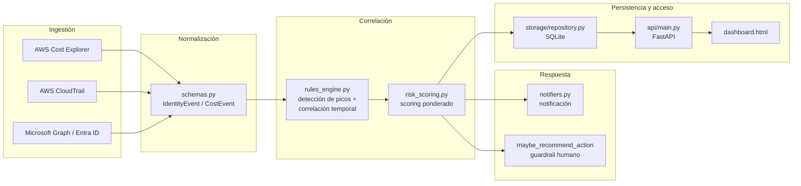

# Arquitectura — SICG (Sentinel Identity & Cost Guard)

## Visión general

El SICG parte de una premisa simple: **un ataque de identidad casi nunca
es solo un evento**. Alguien escala privilegios, y poco después esa
identidad hace algo con esos privilegios — y en la nube, "hacer algo"
casi siempre deja un rastro en la factura. El sistema no mira gasto
anómalo por un lado e IAM por otro; los correlaciona.

## Diagrama de flujo de datos

## Las cuatro capas, y por qué están separadas así

| Capa | Responsabilidad | Por qué es su propia capa |
|---|---|---|
| **Ingestión** | Traer datos crudos de cada proveedor (AWS, Entra ID) | Cada proveedor tiene su propia API, autenticación y formato. Aislarlo aquí significa que añadir GCP mañana no toca ninguna otra capa. |
| **Normalización** | Convertir todo a `IdentityEvent` / `CostEvent` | El motor de correlación nunca debería saber si un evento vino de CloudTrail o de Entra audit logs — solo le importa el tipo de evento y el timestamp. |
| **Correlación** | Detectar picos + correlacionar temporalmente + puntuar | Es el "cerebro" del sistema, y es la única capa con lógica de negocio real. Aislarla la hace testeable sin credenciales ni red. |
| **Respuesta** | Notificar y, opcionalmente, recomendar/ejecutar una acción | Separada de la correlación a propósito: el *qué hacer* es independiente de *cómo se detectó*. |

## Decisiones de diseño con impacto arquitectónico

Ver también `docs/adr/` para el razonamiento completo de cada una.

- **Reglas explicables, no ML** (ADR 0002): cada señal viene con una frase en lenguaje natural de por qué se generó — permite aprobación humana rápida sin auditar una caja negra.
- **Atribución de costo vía `aws:createdBy`**: AWS Cost Explorer no tiene dimensión nativa de "usuario IAM". Se usa la cost allocation tag automática que AWS rellena con el ARN de quien creó cada recurso.
  - **Trade-off aceptado:** recursos creados *antes* de activar esta tag quedan sin atribución hasta que se recreen o retagueen a mano.
- **Kill switch nunca por defecto**: una acción automática solo se ejecuta si se activa explícitamente `auto_response_enabled=True` Y el score supera un umbral alto.
- **Tolerancia a fallos parciales en ingestión**: si CloudTrail falla para un tipo de evento, el resto se sigue consultando.

## Qué NO hace el sistema (alcance explícito del MVP)

- No previene nada en tiempo real — es detección posterior (batch).
- No correlaciona entre proveedores (Entra ID + AWS de la misma persona no se detecta hoy salvo mismo `identity_id`).
- No tiene UI de configuración — los umbrales se cambian editando código.